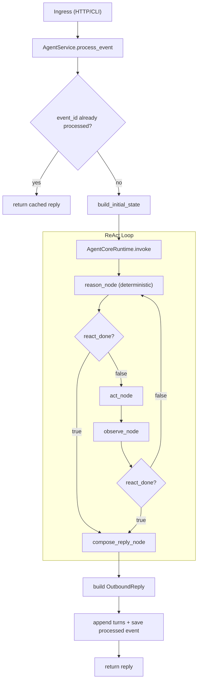
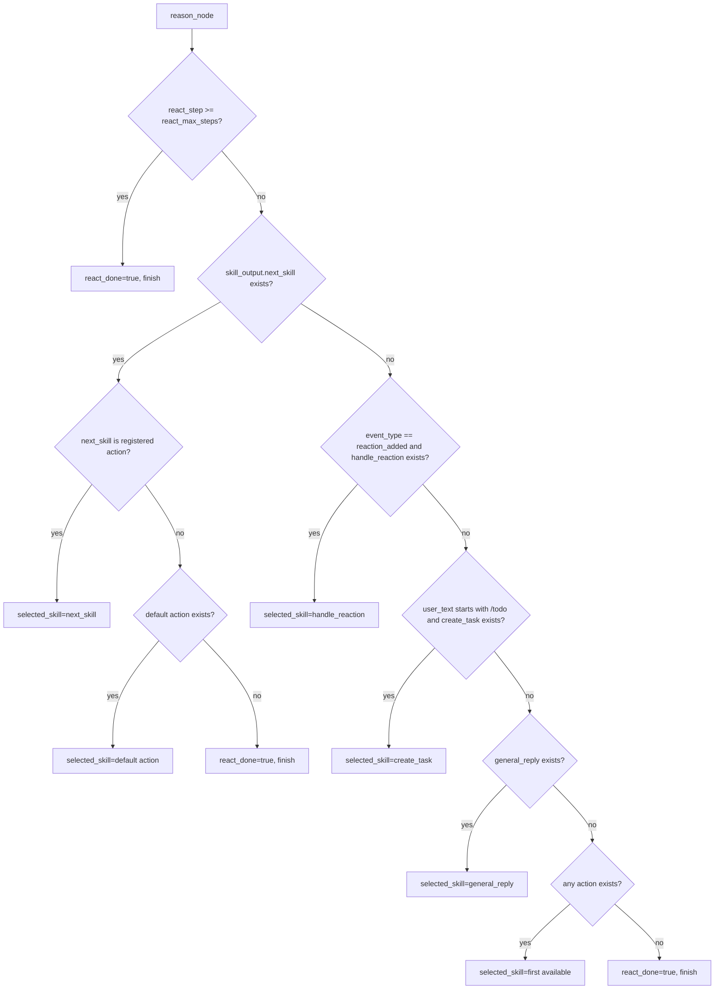

# Agent Core Algorithm (Source of Truth)

## Purpose

This document is the canonical algorithm spec for TeamBot runtime behavior.
Any change to routing, loop termination, tool execution, model prompt contract, or streaming behavior must update this document in the same change.

## Scope

- Runtime loop: `reason -> act -> observe -> (loop | compose_reply)`
- Deterministic reason-stage routing rules
- Tool execution and policy gate behavior
- Model prompt contract used by `general_reply` tool
- Streaming behavior in provider client
- Known design problems

## End-to-End Flow



## Reason Stage Priority (Deterministic)



## Stage-by-Stage Contract

### 1) Build Initial State

- File: `src/teambot/agents/core/state.py`
- Model prompt: none.
- Initializes:
  - `react_step=0`
  - `react_max_steps=3` (default)
  - `react_done=false`
  - `selected_skill=""`
  - `skill_input={}`
  - `skill_output={}`

### 2) Reason (Deterministic Router)

- File: `src/teambot/agents/core/router.py`
- Model prompt: none.
- Responsibility: pick next action or mark done using fixed priority rules only.
- Important: runtime does **not** call a planner model here.

### 3) Act (Unified Action + Policy Gate)

- Files:
  - `src/teambot/agents/core/executor.py`
  - `src/teambot/agents/prompts/general_reply.py`
  - `src/teambot/agents/tools/builtin.py`
- Behavior:
  - `ExecutionPolicyGate` evaluates action risk first.
  - If denied (`high` risk not allowed), returns blocked result.
  - If allowed, invokes selected action through unified action registry.

#### 3.1 `general_reply` model prompt (exact)

Used only when provider manager exists and has `agent_model` role binding.

```text
You are TeamBot's message tool. Return a single JSON object only. No markdown.
Schema: {
  "message": string
}
Rules:
- Keep message concise, practical, and user-facing.
- Do not include JSON outside the object.
- Do not include tool/planner internals.
```

#### 3.2 `general_reply` payload keys

- `event_type`
- `user_text`
- `reaction`
- `conversation_key`
- `react_step`
- `last_observation`

#### 3.3 `general_reply` output validation

- Expects model JSON object with `message` string.
- If provider invocation fails or `message` is invalid/empty, tool falls back to deterministic local message.

### 4) Observe

- File: `src/teambot/agents/core/executor.py`
- Model prompt: none.
- Updates:
  - `react_step += 1`
  - `react_done = (not next_skill) or (step >= max_steps)`
  - appends to `react_notes`
  - appends to `execution_trace`

### 5) Compose Reply

- File: `src/teambot/agents/core/executor.py`
- Model prompt: none.
- `reply_text = skill_output.message` else `"Processed."`

## `react_done` Semantics

`react_done` is the stop flag used by router transitions:

- after `reason`:
  - `react_done=true` -> `compose_reply`
  - `react_done=false` -> continue to `act`
- after `observe`:
  - `react_done=true` -> `compose_reply`
  - `react_done=false` -> next loop iteration

A runtime loop guard (`react_max_steps + 2`) still exists in `AgentCoreRuntime.invoke` to force-safe completion if unexpected loops occur.

## LangChain Usage (Where It Is Actually Used)

LangChain is used in provider client adapters, not in runtime control-flow files:

- `src/teambot/agents/providers/clients.py`
  - `langchain_core.messages`
  - `langchain_openai.ChatOpenAI`
  - `langchain_anthropic.ChatAnthropic`

Runtime call chain for model reply generation:

- `general_reply tool` -> `ProviderManager.invoke_role_json(...)` -> `LangChainProviderClient`

## Streaming Behavior

- Files:
  - `src/teambot/agents/providers/router.py`
  - `src/teambot/agents/providers/clients.py`
- If token callbacks are present, provider client attempts `model.stream(...)`.
- If stream fails or yields no chunks, client falls back to `model.invoke(...)`.
- Therefore visible UX can look like pseudo-streaming when upstream providers emit coarse chunks.

## Known Design Problems (Current)

1. Reason routing is deterministic and rule-based; complex intent selection is limited.
2. Conversation history is stored but not injected into `general_reply` model payload.
3. `observe` marks done when `next_skill` is absent, which biases toward single-step completion.
4. Streaming smoothness still depends on provider chunk granularity.

## Maintenance Checklist

Update this document whenever any of the following changes:

- `src/teambot/agents/core/router.py`
- `src/teambot/agents/core/graph.py`
- `src/teambot/agents/core/executor.py`
- `src/teambot/agents/tools/builtin.py`
- `src/teambot/agents/prompts/general_reply.py`
- `src/teambot/agents/providers/router.py`
- `src/teambot/agents/providers/clients.py`
- `src/teambot/agents/core/state.py`
- `src/teambot/agents/core/service.py`
