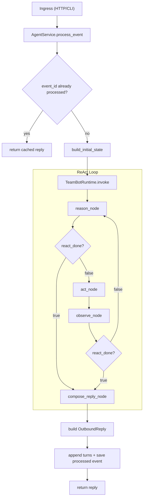
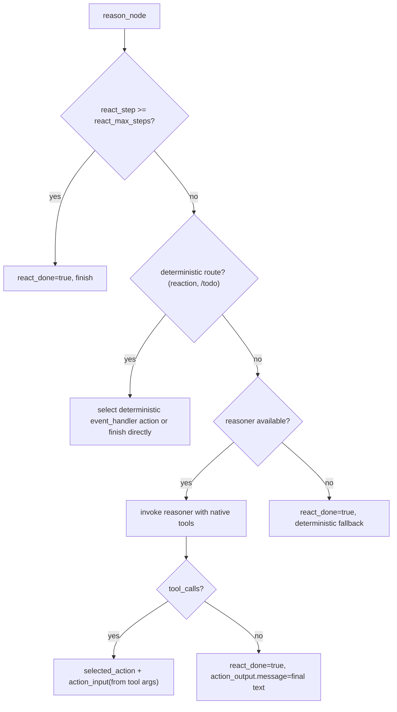

# Agent Core Algorithm (Source of Truth)

## Purpose

This document is the canonical algorithm spec for TeamBot runtime behavior.
Any change to routing, loop termination, tool execution, reasoner prompt/payload contract, or streaming behavior must update this document in the same change.

## Scope

- Runtime loop: `reason -> act -> observe -> (loop | compose_reply)`
- Reason-stage reasoner contract (native tool call or final text)
- Memory-context assembly (session memory, rolling summary state, long-term memory)
- Tool and event-handler execution with policy gate
- Runtime event emission for transcript-style clients
- Built-in tool surface registration with profile + namesake strategy + MCP bridge
- Active skill-doc context injection for reasoner
- Streaming behavior in provider client
- Known design problems

## End-to-End Flow

## Reason Stage Priority

## Stage-by-Stage Contract

### 1) Build Initial State

- File: `src/teambot/agent/state.py`
- Initializes:
  - `recent_turns`, `conversation_summary`, and `memory_system_prompt_suffix` from session memory + `MemoryContextAssembler`
  - `runtime_working_dir=$AGENT_HOME/work`
  - `react_step=0`
  - `react_max_steps=3` (default)
  - `react_done=false`
  - `selected_action=""`
  - `action_input={}`
  - `action_output={}`
  - compatibility aliases:
    - `selected_skill=""`
    - `skill_input={}`
    - `skill_output={}`

### 2) Reason (Reasoner + Deterministic Guards)

- File: `src/teambot/agent/reason.py`
- Responsibilities:
  - deterministic routes for event handlers (`reaction_added`, `/todo`)
  - reasoner call for native model tool-calling or direct final text
  - consume the dedicated request-context assembler from `src/teambot/agent/reasoner_context.py`

#### 2.1 Reasoner Prompt Source

Base system prompt is composed from `AGENT_HOME/system` markdown files in this order:

1. `AGENTS.md` (required)
2. `SOUL.md` (optional)
3. `PROFILE.md` (optional)

Then runtime appends:
- reasoner guidance text
- available skill catalog summary and active skill summary (if available)
- optional long-term memory loaded from `AGENT_HOME/system/memory.md`
- internal visibility rule: user answers must describe capabilities without exposing raw tool/skill/action names

The bounded prompt/payload context sections are assembled through `src/teambot/agent/reasoner_context.py`.

#### 2.2 Reasoner Input/Output Contract

Reasoner payload includes:
- `event_type`, `user_text`, `reaction`, `last_observation`
- `recent_turns` bounded prior conversation turns selected by the session-memory char budget
- `conversation_summary` rolling summary text when present
- `runtime_working_dir` when present so the reasoner can reason about the active workspace root used by file/shell tools
- `skill_catalog` metadata for discovered skill docs (`name`, `description`, `when_to_use`)
- `active_skill_docs` bounded expanded skill docs loaded through `activate_skill`

Reasoner tool schema includes `tool` actions only.
Deterministic `event_handler` actions are excluded from model tool schema.
Skill docs are guidance context only; they are not executable actions by themselves. The model can request skill activation through the low-risk `activate_skill` tool, which loads the chosen `SKILL.md` into runtime state for the next reasoner turn.

Reasoner output is:
- native `tool_calls` -> `selected_action` + `action_input`
- or final text -> `action_output.message`

Invalid/empty reasoner output falls back safely to deterministic final reply.

### 3) Act (Unified Action + Policy Gate)

- Files:
  - `src/teambot/agent/execution.py`
  - `src/teambot/actions/registry.py`
  - `src/teambot/agent/orchestrator.py`
  - `src/teambot/agent/runtime.py`

Behavior:
- `ExecutionPolicyGate` evaluates action risk first.
- If denied (`high` risk not allowed), returns blocked result without invoking handler.
- `RuntimeOrchestrator` only builds registries/tool config/MCP wiring.
- `TeamBotRuntime.reload_runtime()` constructs `PluginHost`, the single unified action surface.
- If allowed, the selected action is invoked through that `PluginHost`.

### 3.1 Action Sources

- `tool`: `activate_skill`, external-operation tools, and optional MCP bridged tools
- `event_handler`: deterministic handlers (`create_task`, `handle_reaction`)

### 3.2 Built-in Tool Profiles

- `minimal`: `activate_skill` only
- `external_operation`: `activate_skill`, `read_file`, `write_file`, `edit_file`, `execute_shell_command`, `browser_use`, `get_current_time`
- `full`: external_operation + `desktop_screenshot` + `send_file_to_user`
- File/shell tools resolve relative paths and command cwd from `runtime_working_dir`, which is initialized from `AGENT_HOME/work`.

### 3.3 High-Risk Tools (Policy-Gated)

- `write_file`
- `edit_file`
- `execute_shell_command`
- `exec_command` (alias)

### 3.4 Skills Runtime Semantics

- Repo builtin skill docs live under `src/teambot/skills/packs`.
- Shared skill docs live under `~/.teambot/skills`.
- Agent-local skill docs live under `AGENT_HOME/skills`.
- Runtime loads builtin + shared + agent-local skill metadata into reasoner context by default.
- Full skill bodies are loaded only after the model or caller selects a skill through `activate_skill` or explicit state activation.
- Legacy `active_skills` remains compatibility-only for old slash commands.
- Skill docs are not registered as executable actions.
- Skill doc changes hot-load naturally because the reasoner skill catalog is read directly from disk during request-context assembly; `/skills sync|enable|disable` no longer trigger `reload_runtime()`.

### 4) Observe

- File: `src/teambot/agent/execution.py`
- Updates:
  - `react_step += 1`
  - `react_done = (step >= max_steps)`
  - append `react_notes`
  - append structured `execution_trace` including action name, action input, blocked flag, and observation
  - control returns to the next `reason` step with `last_observation`

### 5) Compose Reply

- File: `src/teambot/agent/execution.py`
- `reply_text = action_output.message` else `"Processed."`
- legacy alias `skill_output.message` is still read for compatibility

### 5.1 Outbound Reply Surface

- File: `src/teambot/agent/service.py`
- `OutboundReply` now carries:
  - `text`
  - `skill_name`
  - `reasoning_note`
  - `execution_trace`
- This keeps the runtime loop deterministic while allowing presentation layers such as the CLI to render transcript-style output without re-reading internal state.

### 5.2 Store Persistence

- File: `src/teambot/domain/store/memory_store.py`
- Runtime conversation state is now persisted in SQLite at `AGENT_HOME/state/teambot.sqlite`.
- Persisted records include:
  - conversation metadata by `conversation_key`
  - bounded conversation turn history
  - rolling summary state (`rolling_summary`, `last_compacted_seq`)
  - processed-event reply cache for idempotency

### 5.3 Memory Assembly

- Files:
  - `src/teambot/memory/context.py`
  - `src/teambot/memory/session.py`
  - `src/teambot/memory/policy.py`
  - `src/teambot/memory/longterm.py`
  - `src/teambot/memory/compaction.py`
- `SessionMemoryManager` owns session-scoped transcript loading, rolling-summary compaction, and recent-turn selection.
- `CharBudgetMemoryPolicy` is shared by compaction and recent-turn assembly so both layers honor the same session-context budget.
- `MemoryContextAssembler` only merges session memory with long-term memory for reasoner consumption.
- `FileLongTermMemoryProvider` optionally loads `AGENT_HOME/system/memory.md` and appends it to the reasoner system prompt.
- `RollingSummaryCompactionEngine` incrementally compacts older turns into `conversation_state.rolling_summary` while preserving the newest raw turns that fit the session char budget.
- Runtime default summary generation is provider-backed. If no model-backed summary is available, compaction is skipped instead of falling back to a deterministic rewrite.
- Provider routing now uses named model profiles instead of hard-coded model-purpose strings:
  - `agent` profile for the main reasoner/tool-calling path
  - `summary` profile for rolling-summary generation
- Built-in `AGENT_*` / `SUMMARY_*` env groups are shortcut bindings.
- Preferred advanced config is a single runtime config file:
  - `RUNTIME_CONFIG_FILE` points to `config/config.json`
  - provider config lives under `providers.models` and `providers.profiles`
  - tool defaults live under `tools`
  - policy defaults live under `policy`
  - MCP defaults live under `mcp`
  - string values inside `config/config.json` may reference env vars with `${ENV_VAR}`
- `MODEL_PROFILES_JSON` remains as a legacy compatibility path only.

## Runtime Event Stream

- Files:
  - `src/teambot/domain/models.py`
  - `src/teambot/agent/graph.py`
  - `src/teambot/agent/reason.py`
  - `src/teambot/agent/execution.py`
  - `src/teambot/agent/service.py`
- `RuntimeEvent` is the canonical transcript event contract for step-by-step UI clients.
- The agent loop can emit:
  - `thinking_delta`
  - `memory_compacted`
  - `tool_call`
  - `tool_result`
  - `final_delta`
  - `final_text`
  - `run_completed`
- `AgentService.stream_event(...)` runs the same core runtime path, yields `RuntimeEvent` items, persists the final reply, and keeps `process_event(...)` compatibility intact.
- `AgentService.stream_event(...)` also wraps provider token callbacks into runtime-level transcript deltas:
  - `model_reasoning_token` -> `thinking_delta`
  - `model_token` -> `final_delta`
- CLI and TUI now consume the same unified event stream instead of stitching provider callbacks separately.

## `react_done` Semantics

`react_done` is the stop flag:
- after `reason`: done -> compose, else -> act
- after `observe`: done -> compose, else -> next reason step

A loop guard (`react_max_steps + 2`) in `AgentCoreRuntime.invoke` still force-finalizes unexpected loops.

## LangChain Usage

LangChain is used in provider adapters, not in runtime control-flow:
- `src/teambot/providers/clients/langchain.py`

Runtime call chain:
- reason -> `ProviderManager.invoke_profile_tools(profile="agent", ...)` -> `LangChainProviderClient.bind_tools(...)`

## Streaming Behavior

- Files:
  - `src/teambot/providers/manager.py`
  - `src/teambot/providers/clients/langchain.py`
- If token callbacks exist, the provider client tries `model.stream(...)` for both plain-text and tool-bound turns.
- Streamed chunks are normalized back into the same `text + tool_calls` response shape used by non-streaming invocations.
- If streaming fails or yields neither text nor tool calls, the client falls back to `model.invoke(...)`.

## CLI Presentation

- File: `src/teambot/app/cli.py`
- The CLI uses a single transcript presentation driven primarily by `AgentService.stream_event(...)`.
- CLI slash commands are routed through the shared dispatcher in `src/teambot/app/slash_commands.py`.
- Runtime events are rendered as step blocks such as `Step 1 · Thinking`, `Step 1 · Tool`, `Step 1 · Result`, and `Step 2 · Final`.
- `debug on|off` controls whether raw prompt/payload and reasoning-token details are shown.
- `stream on|off` controls whether provider token streaming is rendered live.
- When provider reasoning tokens are available, the CLI appends them live inside the `Thinking` section.
- When provider text tokens are available, the CLI appends them live inside a `Final (live)` section.
- When the last streamed model text matches the final reply, the CLI suppresses duplicate final printing and marks the `Final` section as already streamed live.
- The CLI does not own runtime state transitions. It renders `OutboundReply.reasoning_note` and `OutboundReply.execution_trace` plus optional provider streaming/debug callbacks.

## TUI Presentation

- File: `src/teambot/app/tui.py`
- The TUI consumes the same `AgentService.stream_event(...)` contract as the CLI.
- TUI slash commands also use `src/teambot/app/slash_commands.py`, so supported commands are defined in one place.
- The TUI is terminal-native rather than full-screen: it prints a TeamBot workbench header, then returns to the normal terminal prompt loop.
- Terminal scrollback remains the source of truth for transcript review, selection, and scrolling; there is no application-owned scroll container.
- Empty state uses a compact welcome panel with workspace/model context and quick-start tips.
- Active runs are rendered as:
  - user prompt line (`❯  task`)
  - simple `✻ Thinking...` status line while the agent is still reasoning
  - subdued activity summaries (`used ...`, `observed ...`)
  - prominent final answer line (`⏺ ...`)
- The prompt uses plain terminal input instead of a boxed widget or alternate-screen composer.
- CLI/TUI discard buffered stdin and temporarily suppress terminal echo during an active run so keystrokes typed mid-run do not leak into the next user message or render as stray control characters.
- `final_delta` incrementally updates the visible final answer line in-place.
- `thinking_delta` remains available at the runtime-event layer, but the TUI collapses it into the same `✻ Thinking...` presentation instead of rendering raw token deltas.
- Supported slash commands in the TUI:
  - `/help`
  - `/skills`
  - `/skills sync [--force]` (legacy active-dir compatibility)
  - `/skills enable <name>` (legacy active-dir compatibility)
  - `/skills disable <name>` (legacy active-dir compatibility)
  - `/newthread`
  - `/stream on|off`
  - `/reaction <name>`
  - `/exit`
- `/tools` is intentionally not part of the user-facing slash surface in either CLI or TUI.

## Known Design Problems (Current)

1. Rolling-summary generation now depends on provider availability after the reply path. If no summary-capable model role is available, session compaction is skipped and the raw transcript window continues to grow until a model is configured.
2. Reasoner output quality depends on provider/model behavior and prompt discipline.
3. Browser automation is still not aligned to the OpenClaw-style `browser(action=...)` protocol.
4. Streaming smoothness depends on provider chunk granularity.
5. The terminal-native TUI deliberately favors scrollback stability over rich in-place layout control, so visual structure is simpler than a full-screen app.

## Maintenance Checklist

Update this document whenever any of these change:

- `src/teambot/agent/graph.py`
- `src/teambot/agent/reason.py`
- `src/teambot/agent/execution.py`
- `src/teambot/agent/state.py`
- `src/teambot/agent/service.py`
- `src/teambot/agent/runtime.py`
- `src/teambot/agent/orchestrator.py`
- `src/teambot/actions/registry.py`
- `src/teambot/actions/event_handlers/registry.py`
- `src/teambot/actions/event_handlers/builtin.py`
- `src/teambot/skills/context.py`
- `src/teambot/skills/manager.py`
- `src/teambot/memory/context.py`
- `src/teambot/memory/longterm.py`
- `src/teambot/memory/compaction.py`
- `src/teambot/actions/tools/runtime_builder.py`
- `src/teambot/actions/tools/external_operation_tools.py`
- `src/teambot/mcp/manager.py`
- `src/teambot/agent/prompts/system_prompt.py`
- `src/teambot/providers/manager.py`
- `src/teambot/providers/clients/langchain.py`
