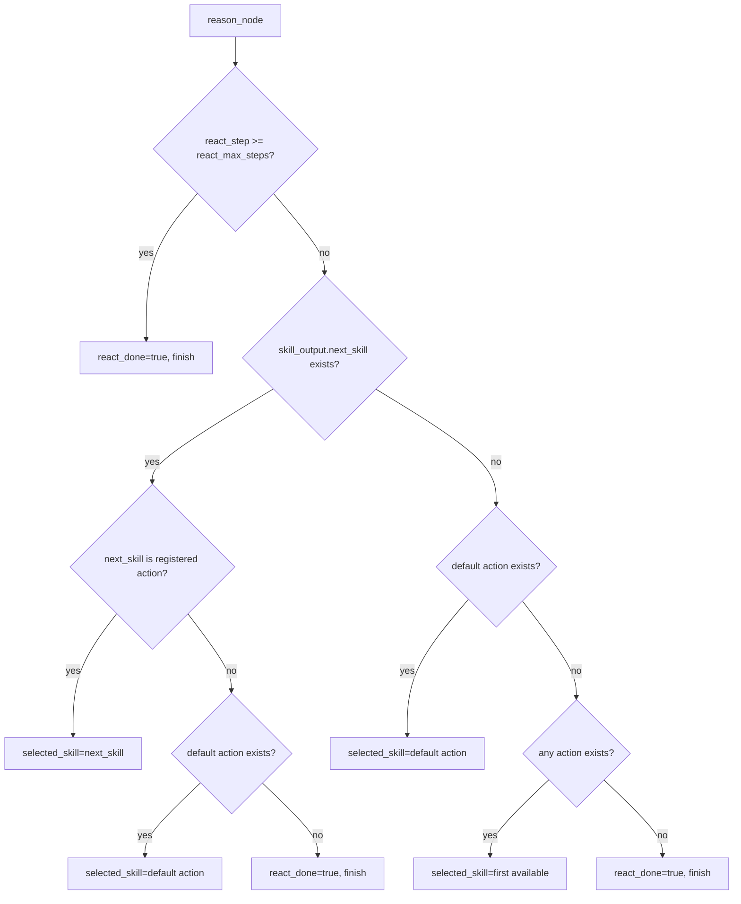

# Agent Core Algorithm (Source of Truth)

## Purpose

This document is the canonical algorithm spec for TeamBot runtime behavior.
Any change to routing, loop termination, tool execution, model prompt contract, or streaming behavior must update this document in the same change.

## Scope

- Runtime loop: `reason -> act -> observe -> (loop | compose_reply)`
- Deterministic reason-stage routing rules
- Tool execution and policy gate behavior
- Built-in tool surface registration with profile + namesake strategy + MCP bridge
- Model prompt contract used by `message_reply` tool (working-dir system prompt)
- Streaming behavior in provider client
- Known design problems

## End-to-End Flow

## Reason Stage Priority (Deterministic)

## Stage-by-Stage Contract

### 1) Build Initial State

- File: `src/teambot/agents/core/state.py`
- Model prompt: none.
- Initializes:
  - `react_step=0`
  - `react_max_steps=3` (default)
  - `react_done=false`
  - `selected_skill=""`
  - `skill_input={}`
  - `skill_output={}`

### 2) Reason (Deterministic Router)

- File: `src/teambot/agents/core/router.py`
- Model prompt: none.
- Responsibility: pick next action or mark done using ReAct state only.
- No event/command hardcoded routing (`reaction_added`, `/todo`) is applied in reason stage.
- Important: runtime does **not** call a planner model here.

### 3) Act (Unified Action + Policy Gate)

- Files:
  - `src/teambot/agents/core/executor.py`
  - `src/teambot/agents/react_agent.py`
  - `src/teambot/agents/prompts/system_prompt.py`
  - `src/teambot/agents/tools/builtin.py`
  - `src/teambot/agents/tools/runtime_builder.py`
  - `src/teambot/agents/tools/catalog.py`
  - `src/teambot/agents/tools/profiles.py`
  - `src/teambot/agents/tools/namesake.py`
  - `src/teambot/agents/tools/external_operation_tools.py`
  - `src/teambot/agents/runtime/orchestrator.py`
  - `src/teambot/agents/mcp/manager.py`
  - `src/teambot/agents/mcp/bridge.py`
- Behavior:
  - `ExecutionPolicyGate` evaluates action risk first.
  - If denied (`high` risk not allowed), returns blocked result.
  - If allowed, invokes selected action through unified action registry.

#### 3.1 `message_reply` model prompt source

Used only when provider manager exists and has `agent_model` role binding.
System prompt is composed from working-directory markdown files in this order:

1. `AGENTS.md` (required)
2. `SOUL.md` (optional)
3. `PROFILE.md` (optional)

#### 3.2 `message_reply` user message input

`message_reply` sends the latest user message text directly (`state.user_text`).

#### 3.3 `message_reply` output handling

- Model output is consumed as plain text (no JSON required).
- If provider invocation fails or output is empty, tool falls back to deterministic local message.

#### 3.4 Built-in tool surface profiles

- Tool set is assembled by runtime profile (`TOOLS_PROFILE`) and namesake strategy (`TOOLS_NAMESAKE_STRATEGY`).
- Supported profiles:
  - `minimal`: `message_reply`
  - `external_operation`: `message_reply` + `read_file`/`write_file`/`edit_file`/`execute_shell_command`/`browser_use`/`get_current_time`
  - `full`: `external_operation` + `desktop_screenshot` + `send_file_to_user`
- Optional debug toggles:
  - `ENABLE_ECHO_TOOL=true` -> `tool_echo`
  - `ENABLE_EXEC_TOOL=true` -> `exec_command` alias
- Namesake strategy controls conflict behavior for runtime-injected tools (`skip|override|raise|rename`).

#### 3.5 High-risk external-operation tools

- The following built-in tools are classified as `high` risk and policy-gated:
  - `write_file`
  - `edit_file`
  - `execute_shell_command`
  - `exec_command` (alias)
- When blocked, runtime returns deterministic blocked output without invoking the underlying handler.

#### 3.6 Skills runtime loading semantics

- Runtime loads skills from `active_skills` only.
- `ensure_skills_initialized()` does not auto-sync skills anymore; it warns when active set is empty.
- Skill enable/sync lifecycle is explicit via skill manager operations.

#### 3.7 MCP runtime injection

- MCP tools are loaded by MCP manager when `MCP_ENABLED=true`.
- MCP tool manifests are bridged into the same `ToolRegistry` and action contract as builtin tools.
- Namesake strategy also applies to MCP-vs-builtin name collisions.

### 4) Observe

- File: `src/teambot/agents/core/executor.py`
- Model prompt: none.
- Updates:
  - `react_step += 1`
  - `react_done = (not next_skill) or (step >= max_steps)`
  - appends to `react_notes`
  - appends to `execution_trace`

### 5) Compose Reply

- File: `src/teambot/agents/core/executor.py`
- Model prompt: none.
- `reply_text = skill_output.message` else `"Processed."`

## `react_done` Semantics

`react_done` is the stop flag used by router transitions:

- after `reason`:
  - `react_done=true` -> `compose_reply`
  - `react_done=false` -> continue to `act`
- after `observe`:
  - `react_done=true` -> `compose_reply`
  - `react_done=false` -> next loop iteration

A runtime loop guard (`react_max_steps + 2`) still exists in `AgentCoreRuntime.invoke` to force-safe completion if unexpected loops occur.

## LangChain Usage (Where It Is Actually Used)

LangChain is used in provider client adapters, not in runtime control-flow files:

- `src/teambot/agents/providers/clients/langchain.py`
  - `langchain_core.messages`
  - `langchain_openai.ChatOpenAI`
  - `langchain_anthropic.ChatAnthropic`

Runtime call chain for model reply generation:

- `message_reply tool` -> `ProviderManager.invoke_role_text(...)` -> `LangChainProviderClient`

## Streaming Behavior

- Files:
  - `src/teambot/agents/providers/manager.py`
  - `src/teambot/agents/providers/clients/langchain.py`
- If token callbacks are present, provider client attempts `model.stream(...)`.
- If stream fails or yields no chunks, client falls back to `model.invoke(...)`.
- Therefore visible UX can look like pseudo-streaming when upstream providers emit coarse chunks.

## Known Design Problems (Current)

1. Reason routing is deterministic and rule-based; complex intent selection is limited.
2. Conversation history is stored but not injected into `message_reply` model payload.
3. `observe` marks done when `next_skill` is absent, which biases toward single-step completion.
4. Streaming smoothness still depends on provider chunk granularity.

## Maintenance Checklist

Update this document whenever any of the following changes:

- `src/teambot/agents/core/router.py`
- `src/teambot/agents/core/graph.py`
- `src/teambot/agents/core/executor.py`
- `src/teambot/agents/tools/builtin.py`
 - `src/teambot/agents/tools/runtime_builder.py`
 - `src/teambot/agents/tools/catalog.py`
 - `src/teambot/agents/tools/profiles.py`
 - `src/teambot/agents/tools/namesake.py`
- `src/teambot/agents/tools/external_operation_tools.py`
 - `src/teambot/agents/runtime/orchestrator.py`
 - `src/teambot/agents/mcp/manager.py`
 - `src/teambot/agents/mcp/bridge.py`
 - `src/teambot/agents/skills/runtime_loader.py`
 - `src/teambot/agents/skills/manager.py`
- `src/teambot/agents/prompts/system_prompt.py`
- `src/teambot/agents/providers/manager.py`
- `src/teambot/agents/providers/clients/langchain.py`
- `src/teambot/agents/core/state.py`
- `src/teambot/agents/core/service.py`
- `src/teambot/agents/react_agent.py`
