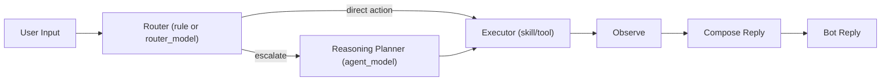
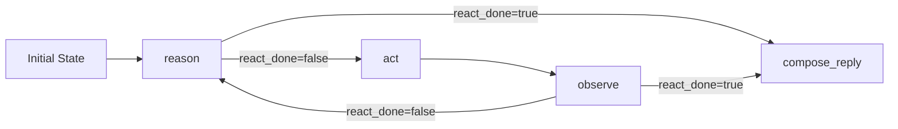

# Agent Runtime Architecture (Router / Planner / Agent Core)

## 1. Runtime Flow

## 2. ReAct Loop (Core)

## 3. Module Mapping

- Router + loop control:
  - `src/teambot/agents/core/router.py`
  - `src/teambot/agents/core/graph.py`
- Planner (rule + model planner):
  - `src/teambot/agents/planner.py`
- Model provider manager:
  - `src/teambot/agents/providers/*`
- Skill/tool execution:
  - `src/teambot/agents/core/executor.py`
  - `src/teambot/plugins/registry.py`
- Composition root:
  - `src/teambot/interfaces/bootstrap.py`
