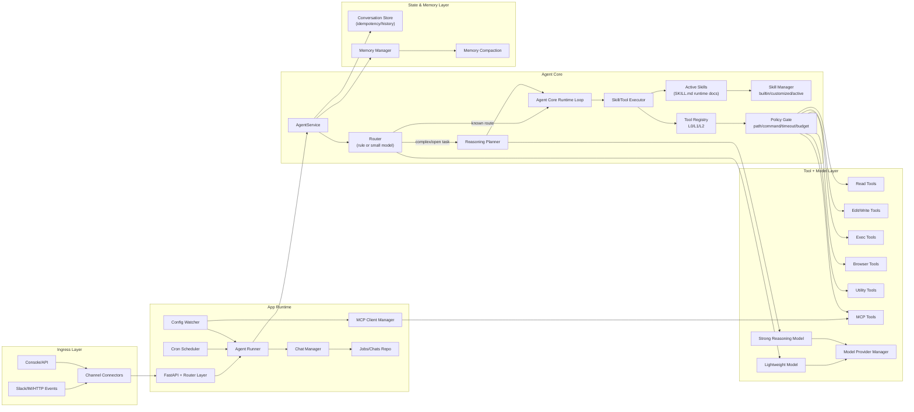
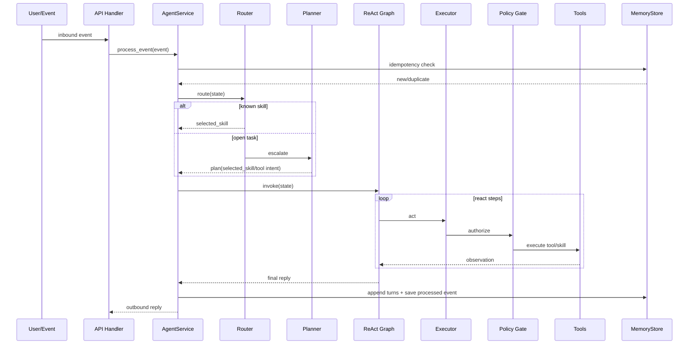
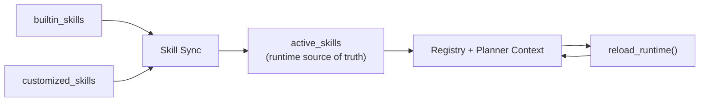

# TeamBot 框架设计文档（V1, Full-Parity Roadmap）

> 注：本文件包含 roadmap 设计草案。当前代码主路径已移除 `planner.py`，运行时采用确定性 `reason -> act -> observe -> compose_reply`。

## 1. 背景

当前项目已具备：

- Agent Core ReAct 主循环（`reason -> act -> observe`）
- 确定性 reason 路由（无模型 planner）
- CoPaw 风格 skills 生命周期雏形（`builtin/customized/active`）

下一阶段目标不是“再加几个功能”，而是把框架设计定型，保证后续扩展（开放工具、动态技能、低成本路由）不返工。

## 1.1 当前范围声明

以下能力 **都必须做**，但按阶段推进，不在同一迭代一次性完成：

- CoPaw 风格 channels 体系
- cron 调度与后台任务
- memory manager + compaction
- MCP 集成

## 1.2 边界基线（本仓库执行标准）

从本阶段开始，后端代码按 `Modular Monolith + Hexagonal + Plugin` 边界推进。  
模块边界与依赖方向以 `docs/architecture-boundaries.md` 为准。

## 2. 目标与非目标

### 2.1 目标

1. 复现 CoPaw 核心机制：开放工具 + SKILL.md 约束 + active skills 运行态。
2. 模型分层降低成本：小模型先路由，复杂任务再升级强模型。
3. 把工具能力做成可治理系统：最小授权、分级风险、可观测。
4. 保持线程路由与幂等不退化（现有 MVP 基线能力保留）。

### 2.2 非目标（本阶段不做）

1. 在单次迭代中同时上线所有模块（必须分阶段并行验证）。
2. 追求工具“全开放无策略”。
3. 在未建立策略门控前开放高风险执行面。
4. 牺牲幂等和可回滚能力换取短期功能速度。

## 3. 设计原则

1. 运行态优先：以 `active_skills` 为唯一生效集合。
2. 模型可替换：router/planner/tool executor 解耦。
3. 决策可追踪：每一步都可观测（选择了什么技能/工具、为何回退）。
4. 安全默认拒绝：高风险工具默认关闭，按需显式开启。

## 4. 总体架构

## 4.1 运行时序图（单次消息）

## 4.2 Skills 生命周期图

## 4.3 组件到代码映射（当前仓库）

| 架构组件 | 代码位置 | 说明 |
|---|---|---|
| Ingress/API | `src/teambot/main.py` | 事件入口、skills 管理 API、健康检查 |
| Service Facade | `src/teambot/agents/core/service.py` | 组装 registry/planner/graph，处理单次事件 |
| ReAct Runtime | `src/teambot/agents/core/graph.py` | 自研循环：`reason/act/observe/compose` |
| Router Node | `src/teambot/agents/core/router.py` | reason 节点与 reason 后路由决策 |
| Executor Nodes | `src/teambot/agents/core/executor.py` | `act/observe/compose_reply` 执行与收敛 |
| State Builder | `src/teambot/agents/core/state.py` | `build_initial_state` 初始化状态 |
| Planner | （已移除） | 历史设计项，当前运行时不使用 |
| Skills Registry | `src/teambot/agents/skills/registry.py` | 技能注册、查找、调用 |
| Builtin Skills | `src/teambot/agents/skills/builtin.py` | 内置 handler 实现 |
| Skills Lifecycle | `src/teambot/agents/skills/manager.py` | `builtin/customized/active` 同步与启停 |
| Runtime Store | `src/teambot/store.py` | 会话历史和幂等事件缓存 |
| State Schema | `src/teambot/models.py` | `AgentState/InboundEvent/OutboundReply` |

## 5. 核心模块设计

### 5.1 Router（低成本入口）

职责：

- 在“已注册技能名集合”内做第一跳选择。
- 判断是否需要升级到开放式 planner。

策略：

- 不使用 `confidence` 分数；采用规则触发升级：
  - 命中开放任务意图（文件分析、命令执行、多步操作）
  - 目标技能缺失
  - 路由失败或输出为空

### 5.2 Planner（强模型）

输入：

- 当前事件与上下文
- `available_skills`
- `active_skill_docs`（来自 `SKILL.md`）

输出（结构化 JSON）：

- `selected_skill`
- `skill_input`
- `done`
- `final_message`
- `note`

回退：

- planner 失败 -> 回退到默认 action 或安全结束
- 非法技能 -> 默认技能或终止回复

扩展要求（对齐 CoPaw 路线）：

- 支持 MCP tool 能力选择
- 支持技能文档 + 系统文档联合注入
- 支持成本/风险预算决策（超限降级）

### 5.2.1 单主模型机制（CoPaw 对齐）

采用单主模型 + 非模型规则分流：

1. 外层薄编排（非模型）
   - 位置：`Runner/Service`
   - 目标：事件标准化、线程路由、策略前置校验
   - 不做模型路由判断

2. 主 Agent 模型（agent_model）
   - 位置：`Agent Planner`（ReAct 主循环）
   - 目标：规划、技能选择、工具调用决策、异常回退
   - 输出：结构化 `PlanResult`

3. 决策边界
   - 简单任务：确定性 reason 规则直接给出技能
   - 复杂/开放任务：进入主 Agent 模型推理
   - 失败回退：agent_model -> 默认 action -> 安全结束

### 5.2.2 多 Provider 模型管理

模型层支持多个 Provider，但当前只维护单角色 `agent_model`：

1. Provider 抽象
   - 统一接口：`chat(model_id, messages, options)`
   - 支持 OpenAI 兼容与非兼容 provider adapter

2. 角色绑定
   - `agent_model`: 可配置 provider + model

3. 运行策略
   - 首选 provider 失败时按优先级 failover
   - 保留调用审计（provider、model、token、latency、error）

### 5.3 Skills 生命周期

目录语义：

- `builtin`: 代码内置技能包
- `customized`: 用户自定义技能包
- `active`: 当前启用技能（运行态）

规则：

1. 启动时若 `active` 为空：从 `builtin + customized` 同步。
2. `customized` 同名覆盖 `builtin`。
3. 运行时只读取 `active`，并支持 `enable/disable/sync` 后热重载。

技能包规范：

- 必须包含 `SKILL.md`
- 可选 `scripts/`、`references/`
- `SKILL.md` frontmatter 至少包含 `name`、`description`

### 5.4 Tool Framework（开放工具层）

工具注册分层：

- `L0` 只读：`read_file`, `glob`, `grep`
- `L1` 写入：`edit_file`, `write_file`
- `L2` 高风险：`execute_shell_command`, external network

默认策略：

1. 默认启用 `L0`
2. `L1/L2` 需显式开关
3. `L2` 需要命令策略校验（denylist + allowlist + timeout）

Policy Gate 必须校验：

- 路径范围（工作目录白名单）
- 命令黑名单（破坏性命令）
- 执行超时与输出上限
- 每轮工具调用次数上限

必须纳入（阶段内完成）：

- Browser tool（可视/无头模式）
- MCP tool bridge（按 server/tool allowlist 放行）
- 风险审计日志（每次工具调用落地）

### 5.5 Agent 执行契约（ReAct 节点级）

`reason` 节点：

1. 输入：`AgentState + available_skills + active_skill_docs`
2. 输出：
   - 继续执行：`selected_skill + skill_input`
   - 直接结束：`react_done=true + skill_output.message`
3. 回退：
   - planner 异常 -> 默认 action 或安全结束
   - 非法技能 -> 默认技能（若存在）

`act` 节点：

1. 输入：`selected_skill + full state`
2. 输出：`skill_output`
3. 错误策略：技能调用异常需转为结构化错误消息，不应直接炸掉 graph

`observe` 节点：

1. 输入：`skill_output`
2. 输出：
   - `react_step += 1`
   - `react_notes` 追加观察记录
   - 决定 `react_done`

`compose_reply` 节点：

1. 输入：`skill_output.message`
2. 输出：`reply_text`
3. 兜底：缺省消息 `已处理。`

### 5.6 失败与回退模型

1. 路由失败：退回默认技能路径。
2. planner 失败：退回默认 action 或安全结束。
3. 非法技能名：退回默认技能或直接结束。
4. 达到最大步数：强制结束。
5. 技能执行异常：返回可见错误上下文，避免静默失败。
6. 幂等命中：直接返回已处理结果，不重复执行。

## 6. ReAct 状态模型

建议保留并扩展当前状态：

- `react_step`
- `react_max_steps`
- `react_done`
- `react_notes`
- `selected_skill`
- `skill_input`
- `skill_output`

新增建议字段：

- `selected_tool`（可选）
- `tool_calls_count`
- `policy_decision`（allow/deny + reason）

## 7. API 设计（框架层）

现有：

- `GET /skills`
- `POST /skills/sync`
- `POST /skills/{name}/enable`
- `POST /skills/{name}/disable`

建议新增：

- `GET /tools`：查看当前启用工具及风险级别
- `POST /tools/{name}/enable|disable`
- `GET /runtime/policies`：查看当前策略快照

## 8. 可观测性

最小观测集：

1. 路由命中率（router -> skill）
2. planner 升级率与失败回退率
3. 工具调用成功率/拒绝率
4. 平均步骤数、平均时延、token 消耗

日志字段建议：

- `event_id`
- `conversation_key`
- `selected_skill`
- `selected_tool`
- `policy_action`
- `fallback_reason`

## 9. 迭代里程碑

### M1（当前）

- ReAct 主链路
- skills 生命周期（基础）
- planner + fallback

### M2（下个迭代）

- 工具分级注册与策略门控
- router/planner 双层模型编排稳定化
- channels 基础接入（至少 1-2 个真实渠道）
- Provider manager（多 provider + 路由模型/推理模型配置）

### M3

- SKILL.md metadata（如 `requires`）纳入执行策略
- 运行指标与审计日志完善
- cron 调度与任务执行链路
- memory manager + compaction

### M4

- CLI 配置体验（skills/tools/policy）
- MCP 集成（manager + watcher + tool bridge + policy）
- CoPaw 级别运行运维能力闭环

## 10. 风险与应对

风险：

1. 强模型误调用高风险工具
2. `SKILL.md` 指令与策略冲突
3. 技能集变化导致行为漂移

应对：

1. 策略门控先于工具执行
2. `active` 作为唯一运行态并可回滚
3. 每次技能变更触发 runtime reload + 快速回归测试

## 11. 与 CoPaw 对照（相同/不同）

| 维度 | TeamBot 当前设计 | CoPaw | 结论 |
|---|---|---|---|
| 核心模式 | ReAct 自研循环（Agent Core） | ReActAgent（AgentScope） | 同类机制，不同框架 |
| 技能目录形态 | `SKILL.md` + `builtin/customized/active` | `SKILL.md` + `builtin/customized/active` | 基本一致 |
| 运行态技能源 | `active_skills` | `active_skills` | 一致 |
| 技能启停方式 | API（`sync/enable/disable`） | CLI（`skills list/config`） | 形态不同，能力等价 |
| 工具注册模式 | 分级 + policy gate（建设中） | 固定工具子集 + skills 组合 | 目标趋同，需补完 |
| 模型 provider | 规划为多 provider + 双模型 | provider + model 工厂化管理 | 方向一致，需落地 |
| 系统提示构建 | 当前较轻量 | working-dir 多文件聚合（AGENTS/SOUL/PROFILE） | TeamBot 偏轻 |
| Memory 扩展 | 轻量 MemoryStore（将增强） | 记忆管理 + compaction | 需补完 |
| 渠道/任务生态 | 基础事件入口（将扩展） | channels + cron + app runner | 需补完 |
| MCP | 已列入必做路线 | 已有集成能力 | 目标对齐中 |

## 12. 对齐策略（Full-Parity 前提）

1. 先完成 tools 分级注册与 policy gate，使开放工具链可控。
2. 并行补 channels/cron/memory manager，形成完整执行链路。
3. 在策略与审计到位后接入 MCP bridge，确保可控放行。
4. 最后补 CLI 运维体验（skills/tools/policy/channels/jobs），提升长期可维护性。
