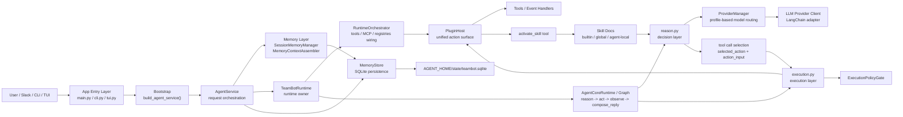
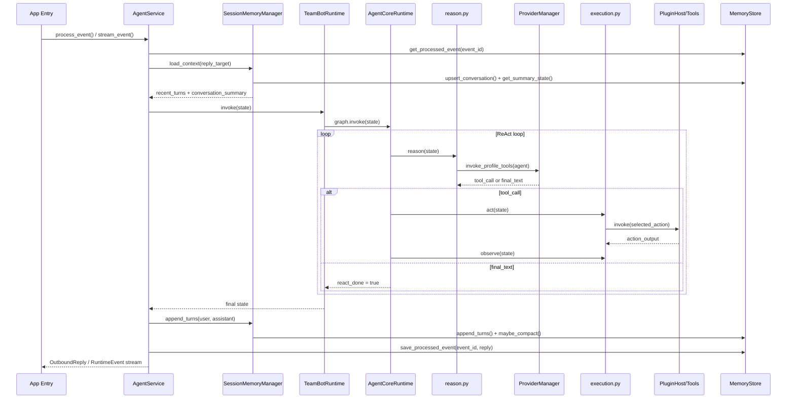
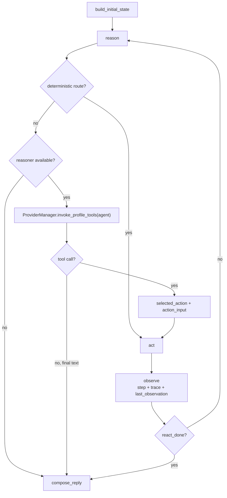
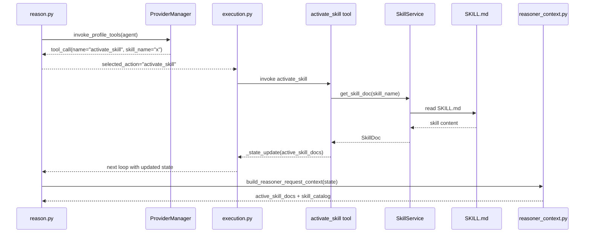
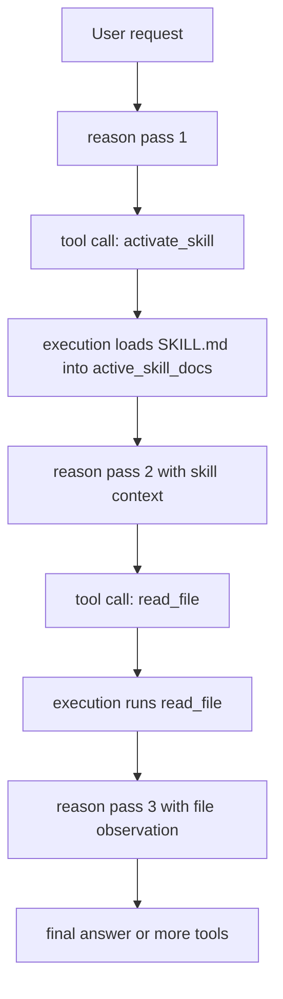

# Agent Runtime Architecture

## 1. Purpose

This document focuses on the TeamBot agent runtime path and explains how a single request travels through:

- `app` entry layer
- `agent/service`
- `agent/runtime`
- `agent/graph`
- `agent/reason`
- `agent/execution`
- `memory`
- `tools`
- `providers`
- `skills` as a separate context-loading side path

This is the most important architecture path in the repository because it defines how TeamBot receives a request, decides what to do, executes actions, and persists the result.

## 2. Architecture Summary

TeamBot is not a prompt-only chatbot wrapper.

Its core is a self-owned agent runtime built around a deterministic ReAct loop:

`reason -> act -> observe -> compose_reply`

The runtime separates four concerns:

- request orchestration
- runtime assembly
- decision making
- action execution

That separation is what makes the system extensible without turning the agent core into a large, coupled handler.

## 3. End-to-End Layer View

## 4. Main Request Path

## 5. Agent Core Control Flow

## 6. Layer Responsibilities

### 6.1 App Entry Layer

The app layer is the ingress and presentation boundary. It does not own agent logic.

- `src/teambot/app/main.py`
  - FastAPI ingress for `/events/slack`, `/skills`, `/conversations`, `/health`
- `src/teambot/app/cli.py`
  - interactive transcript client
- `src/teambot/app/tui.py`
  - terminal-native transcript client
- `src/teambot/app/bootstrap.py`
  - single composition root

Architecturally, this layer behaves like the current gateway layer:

- receives external requests
- builds the shared `AgentService`
- forwards the request into the runtime
- returns final reply or streaming runtime events

It should stay thin.

## 6.2 AgentService

`AgentService` is the request-level orchestrator.

It owns:

- processed-event idempotency check
- reply target resolution
- loading memory context
- building initial runtime state
- invoking the runtime
- persisting conversation turns
- persisting processed replies
- bridging provider token callbacks into runtime events for CLI/TUI

In short:

`AgentService` prepares the request before the loop, and closes the request after the loop.

Representative code:

- state build: `src/teambot/agent/service.py`
- persistence path: `process_event()` and `stream_event()`

## 6.3 TeamBotRuntime

`TeamBotRuntime` is the runtime owner.

It does not decide actions directly. Instead, it assembles the execution environment:

- provider manager
- policy gate
- event handler registry
- tool registry
- plugin host
- MCP manager
- graph

This is important because runtime assembly is isolated from runtime execution.

That means:

- changing tool profile does not require rewriting graph logic
- injecting MCP does not change `reason.py`
- replacing provider wiring does not change `execution.py`

## 6.4 Agent Graph

`AgentCoreRuntime` in `graph.py` is the loop executor.

Its role is simple and strict:

1. call `reason`
2. if finished, compose reply
3. otherwise call `act`
4. call `observe`
5. decide whether to loop again

This layer is intentionally narrow.

It is the control plane of the runtime, not the intelligence plane.

## 6.5 Reason Layer

`reason.py` is the decision layer.

It decides the next move in three stages:

1. stop early if max step is reached
2. check deterministic direct routes
3. call the reasoner through `ProviderManager`

The output contract is intentionally narrow:

- either produce `selected_action + action_input`
- or produce final reply text

This makes the downstream execution layer deterministic.

Key points:

- event handlers like reaction and `/todo` are routed before the model
- model tool-calling is translated into runtime action selection
- if no provider is available, the system falls back safely to a deterministic reply

## 6.6 Execution Layer

`execution.py` owns action execution and observation.

It has three responsibilities:

- resolve the chosen action from state
- pass the action through `ExecutionPolicyGate`
- invoke the unified action surface and record the observation

`observe()` then updates:

- `react_step`
- `react_done`
- `react_notes`
- `execution_trace`

This design matters because the reasoner never executes tools directly.

The reasoner only selects.
The execution layer enforces policy and records results.

## 6.7 Memory Layer

The memory layer is support infrastructure for the agent core.

It does not decide actions.
It prepares bounded context for reasoning and preserves conversational continuity.

### Session memory

`SessionMemoryManager` loads:

- conversation identity
- rolling summary
- bounded recent turns

### Memory assembly

`MemoryContextAssembler` converts session memory into runtime-ready context:

- `recent_turns`
- `conversation_summary`
- `memory_system_prompt_suffix`

### Compaction

`RollingSummaryCompactionEngine` compresses older turns into a rolling summary when the recent-turn window grows beyond budget.

### Store

`MemoryStore` persists:

- conversations
- conversation turns
- processed events
- rolling summary state

The current backing store is SQLite:

- `AGENT_HOME/state/teambot.sqlite`

## 6.8 Tools Layer

The tools layer is the executable action surface.

It includes:

- file operations
- shell execution
- web fetch
- browser operations
- time lookup

The important architecture rule is:

tools execute external operations, but they do not own runtime control flow.

They are registered into `ToolRegistry`, merged into `PluginHost`, and invoked only through `execution.py`.

This keeps tool capability separate from agent orchestration.

## 6.9 Provider Layer

The provider layer is the model access abstraction.

`ProviderManager` routes by named profile instead of hardcoding model usage into the agent core.

Current key profiles:

- `agent`
  - main reasoner and tool-calling path
- `summary`
  - rolling-summary compaction path

This is a strong architectural choice because it decouples:

- runtime intent
- provider implementation
- model configuration

So the agent core says "invoke the agent profile", not "call Anthropic/OpenAI directly".

## 7. Skill Activation Side Path

Skills should be explained separately from the main runtime.

They are not direct runtime stages like `reason` or `execution`.
They are a context-loading side path triggered through a tool call.

The important rule is:

- the model does not execute a skill directly
- the model calls the low-risk tool `activate_skill`
- runtime reads the selected `SKILL.md`
- runtime stores that content into `active_skill_docs`
- the next `reason` turn receives those instructions as reasoner context

That means a skill behaves like dynamic runtime guidance, not like an executable plugin.

### 7.1 What Happens After a Skill Is Activated

After `activate_skill` succeeds:

- `execution.py` merges `_state_update` into runtime state
- `active_skill_docs` is preserved in the state
- the next `reason` pass rebuilds the reasoner request context
- `reasoner_context.py` injects skill context into prompt suffix and payload fields
- the model then decides the next real action, such as `read_file`, `web_fetch`, or `execute_shell_command`

So the real sequence is:

1. model asks to load a skill
2. runtime loads the skill document
3. next model turn reasons with that skill loaded
4. model chooses the actual operational tool

### 7.2 Example: Tool Call Reads a Skill, Then Reads a File

If the user asks for a workflow that depends on a skill, the path is:

This is the key message for presentation:

skills do not replace tools.
Skills shape the next reasoning step so the model can choose better tools.

## 8. Why This Design Works

This architecture works because it separates request orchestration, decision making, execution, memory, and provider access into different layers.

The most important separations are:

- `AgentService` handles request lifecycle, not reasoning
- `Graph` handles loop control, not provider wiring
- `reason.py` decides, but does not execute
- `execution.py` executes, but does not decide
- `memory` supplies context, but does not own the final prompt contract
- `providers` supply model access, but do not know runtime flow
- `skills` are loaded as context, but do not execute business logic themselves

This separation makes the system easier to extend and safer to evolve.

## 9. Key Source Files

- `src/teambot/app/main.py`
- `src/teambot/app/bootstrap.py`
- `src/teambot/agent/service.py`
- `src/teambot/agent/runtime.py`
- `src/teambot/agent/graph.py`
- `src/teambot/agent/reason.py`
- `src/teambot/agent/execution.py`
- `src/teambot/agent/state.py`
- `src/teambot/memory/session.py`
- `src/teambot/memory/context.py`
- `src/teambot/memory/compaction.py`
- `src/teambot/domain/store/memory_store.py`
- `src/teambot/actions/registry.py`
- `src/teambot/actions/tools/catalog.py`
- `src/teambot/actions/tools/external_operation_tools.py`
- `src/teambot/skills/manager.py`
- `src/teambot/skills/context.py`
- `src/teambot/providers/manager.py`

## 10. Presentation Summary

For presentation purposes, the simplest way to explain TeamBot is:

1. `app` receives the request
2. `AgentService` prepares state and memory
3. `TeamBotRuntime` assembles the runtime
4. `Graph` runs the ReAct loop
5. `reason.py` decides
6. `execution.py` executes and observes
7. `memory` and `store` preserve continuity
8. `providers` give the agent model-backed reasoning
9. `skills` are optional context-loading helpers activated through a tool call

If only one sentence is needed:

TeamBot is a layered ReAct agent runtime where `AgentService` owns request lifecycle, `Graph` owns loop control, `reason.py` owns decision making, `execution.py` owns safe action execution, and skills are loaded separately as runtime guidance through `activate_skill`.
